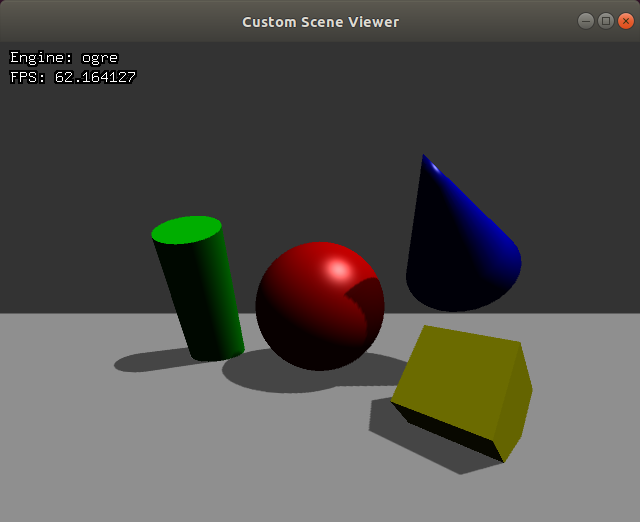

# Custom scene viewer

This application allows us to view a number of pre constructed scenes. 
The initial render engine is Ogre. 

When the application starts you will see a blank window.
When you click the `+` or `-` keys you can change the scene. 
By pressing the `Tab` button you will advance to the next render engine.
 
You may see the render engine title in the window change to Optix if you have compiled your Ignition Rendering library with OptiX (otherwise you can only use Ogre). 
The frame rate may also change based on your computer's capabilities.

The following scenes have more primitive objects such as cones or cilinders. Again, you can see the scene with different render engines pressing `Tab`.
Some of the scenes available include:

 - Textures
 - Normal mapping
 - Reflective property
 - Soft shadows

There are some scenes that are not available in Ogre because we have not or we cannot implement it in Ogre.

## Compile and run the example

Create a build directory and use `cmake` and `make` to compile the code:

```{.sh}
cd ign-rendering/examples/custom_scene_viewer
mkdir build
cd build
cmake ..
make
```

To run the example:

```{.sh}
./custom_scene_viewer
```



## Code

In the main function we can have a look at all the defined scenes.

```{.cpp}
...
    sceneDemo->AddScene(SceneBuilderPtr(new SceneBuilder));
    sceneDemo->AddScene(SceneBuilderPtr(new SimpleSceneBuilder));
    sceneDemo->AddScene(SceneBuilderPtr(new AllShapesSceneBuilder));
    sceneDemo->AddScene(SceneBuilderPtr(new TextureSceneBuilder));
    sceneDemo->AddScene(SceneBuilderPtr(new NormalMapSceneBuilder));
    sceneDemo->AddScene(SceneBuilderPtr(new ReflectionSceneBuilder));
    sceneDemo->AddScene(SceneBuilderPtr(new NormalReflectionSceneBuilder));
    sceneDemo->AddScene(SceneBuilderPtr(new ShadowSceneBuilder(1)));
    sceneDemo->AddScene(SceneBuilderPtr(new ShadowSceneBuilder(2)));
    sceneDemo->AddScene(SceneBuilderPtr(new ShadowSceneBuilder(3)));
    sceneDemo->AddScene(SceneBuilderPtr(new ShadowSceneBuilder(4)));
    sceneDemo->AddScene(SceneBuilderPtr(new ShadowSceneBuilder(5)));
...
```

Inside `SceneBuilder.cc` some classes are defined which create the world. The method `BuildScene` will create the world for each scene.

For example, we can have a look at the `SimpleSceneBuilder` class inside `SceneBuilder.cc`. This class will only define the floor, the sphere and the light.

```{.cpp}
void SimpleSceneBuilder::BuildScene(ScenePtr _scene)
{
  SceneBuilder::BuildScene(_scene);
  VisualPtr root = _scene->RootVisual();
  _scene->SetAmbientLight(0.1, 0.1, 0.1);

  DirectionalLightPtr light = _scene->CreateDirectionalLight(LIGHT);
  light->SetDirection(0.3, 0.5, -1.0);
  light->SetDiffuseColor(0.8, 0.8, 0.8);
  light->SetSpecularColor(0.8, 0.8, 0.8);
  root->AddChild(light);

  VisualPtr sphere = _scene->CreateVisual(SPHERE);
  sphere->AddGeometry(_scene->CreateSphere());
  sphere->SetLocalPosition(3.0, 0.0, 0.5);
  sphere->SetLocalRotation(0.0, 0.0, 0.0);
  sphere->SetMaterial("Red");
  root->AddChild(sphere);

  VisualPtr plane = _scene->CreateVisual(PLANE);
  plane->AddGeometry(_scene->CreatePlane());
  plane->SetLocalPosition(3.0, 0.0, 0.0);
  plane->SetLocalRotation(0.0, 0.0, 0.0);
  plane->SetLocalScale(5.0, 10.5, 1.0);
  plane->SetMaterial("White");
  root->AddChild(plane);
}
```

The `AllShapesSceneBuilder` class inside `SceneBuilder.cc` will define more objects such us: `CYLINDER`, `CONE` or `BOX`.

```{.cpp}
void AllShapesSceneBuilder::BuildScene(ScenePtr _scene)
{
  SimpleSceneBuilder::BuildScene(_scene);
  VisualPtr root = _scene->RootVisual();

  VisualPtr cylinder = _scene->CreateVisual(CYLINDER);
  cylinder->AddGeometry(_scene->CreateCylinder());
  cylinder->SetLocalPosition(3.3, 1.0, 0.5);
  cylinder->SetLocalRotation(0.0, -0.5, 0.0);
  cylinder->SetLocalScale(0.5, 0.5, 1.5);
  cylinder->SetMaterial("Green");
  root->AddChild(cylinder);

  VisualPtr cone = _scene->CreateVisual(CONE);
  cone->AddGeometry(_scene->CreateCone());
  cone->SetLocalPosition(2.6, -0.8, 1.2);
  cone->SetLocalRotation(-0.5, -0.75, 0.0);
  cone->SetLocalScale(0.8, 0.8, 1.0);
  cone->SetMaterial("Blue");
  root->AddChild(cone);

  VisualPtr box = _scene->CreateVisual(BOX);
  box->AddGeometry(_scene->CreateBox());
  box->SetLocalPosition(2.2, -0.8, 0.2);
  box->SetLocalRotation(IGN_PI / 4, 0.0, IGN_PI / 4);
  box->SetLocalScale(0.5, 0.5, 0.5);
  box->SetMaterial("Yellow");
  root->AddChild(box);
}
```

The class `TextureSceneBuilder` includes all the objects and the textures:

```{.cpp}
void TextureSceneBuilder::BuildScene(ScenePtr _scene)
{
  AllShapesSceneBuilder::BuildScene(_scene);

  VisualPtr box = _scene->VisualByName(BOX);
  box->SetMaterial("TextureYellow");

  VisualPtr cone = _scene->VisualByName(CONE);
  cone->SetMaterial("TextureBlue");

  VisualPtr cylinder = _scene->VisualByName(CYLINDER);
  cylinder->SetMaterial("TextureGreen");

  VisualPtr plane = _scene->VisualByName(PLANE);
  plane->SetMaterial("TextureWhite");

  VisualPtr sphere = _scene->VisualByName(SPHERE);
  sphere->SetMaterial("TextureRed");
}
```

The class `NormalMapSceneBuilder` includes all the objects, the textures and the normal maps:

```{.cpp}
void NormalMapSceneBuilder::BuildScene(ScenePtr _scene)
{
  TextureSceneBuilder::BuildScene(_scene);

  VisualPtr box = _scene->VisualByName(BOX);
  box->SetMaterial("NormalYellow");

  VisualPtr cone = _scene->VisualByName(CONE);
  cone->SetMaterial("NormalBlue");

  VisualPtr cylinder = _scene->VisualByName(CYLINDER);
  cylinder->SetMaterial("NormalGreen");

  VisualPtr plane = _scene->VisualByName(PLANE);
  plane->SetMaterial("NormalWhite");

  VisualPtr sphere = _scene->VisualByName(SPHERE);
  sphere->SetMaterial("NormalRed");
}
```
