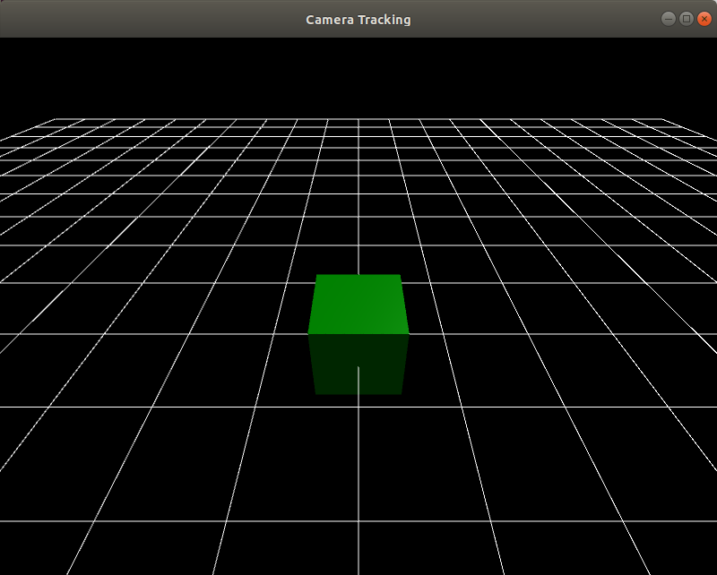

# Camera tracking

This example allows you to move a box inside the world. Using `W` and `S` you can move the box forward or backward and pressing `A` or `D` you can rotate the box. You can also set up how to you want to track the object and fix the offset

# Compile and run the example

Create a build directory and use `cmake` and `make` to compile the code:

```{.sh}
cd ign-rendering/examples/camera_tracking
mkdir build
cd build
cmake ..
make
```

To run the example:

```{.sh}
./camera_tracking
===============================
  TAB - Switch render engines  
  ESC - Exit                   

  W: Move box forward          
  S: Move box backward         
  A: Rotate box to the left    
  D: Rotate box to the right   

  1: Camera tracking only      
  2: Camera tracking and       
     following                 
  3: Camera tracking and       
     following (world frame)   

  T: Toggle smooth tracking    
  F: Toggle smooth following   

  Track offset                 
  u/U: +- 0.1 on X             
  i/I: +- 0.1 on Y             
  o/O: +- 0.1 on Z             

  Follow offset                
  j/J: +- 0.1 on X             
  k/K: +- 0.1 on Y             
  l/L: +- 0.1 on Z             
===============================

```



# Code

There are three main method in the Camera class that allows us to follow and track the object:

 - **SetTrackTarget**: Set a node for camera to track. The camera will automatically change its orientation to face the target being tracked. If null is specified, tracking is disabled. In contrast to SetFollowTarget the camera does not change its position when tracking is enabled.
 ```{.cpp}
 void SetTrackTarget(const NodePtr & 	_target,
                       const math::Vector3d & 	_offset = math::Vector3d::Zero,
                       const bool 	_worldFrame = false
 )
 ```
 Parameters:
    - *_target*:	Target node to track
    - *_offset*:	Track a point that is at an offset relative to target.
    - *worldFrame*:	If true, the offset point to track will be treated in world frame and its position relative to the target node remains fixed regardless of the target node's rotation. Default is false, which means the camera tracks the point in target node's local frame.
 - **SetWorldPosition**: Set the world pose.
 ```{.cpp}
void 	SetWorldPose (const math::Pose3d &_pose)
void 	SetWorldPosition (double _x, double _y, double _z)
void 	SetWorldPosition (const math::Vector3d &_position)
void 	SetWorldRotation (double _r, double _p, double _y)
void 	SetWorldRotation (double _w, double _x, double _y, double _z)
void 	SetWorldRotation (const math::Quaterniond &_rotation)
 ```
 - **SetFollowTarget**: Set a node for camera to follow. The camera will automatically update its position to keep itself at the specified offset distance from the target being followed. If null is specified, camera follow is disabled. In contrast to SetTrackTarget, the camera does not change its orientation when following is enabled.
 ```{.cpp}
 void SetFollowTarget(const NodePtr & 	_target,
                        const math::Vector3d & 	_offset = math::Vector3d::Zero,
                        const bool 	_worldFrame = false )
 ```
 Parameters:
  - *_target*:	Target node to follow
  - *_offset*:	Tether the camera at an offset distance from the target node.
  - *_worldFrame*:	True to follow the target node at a distance that's fixed in world frame. Default is false which means the camera follows at fixed distance in target node's local frame.
