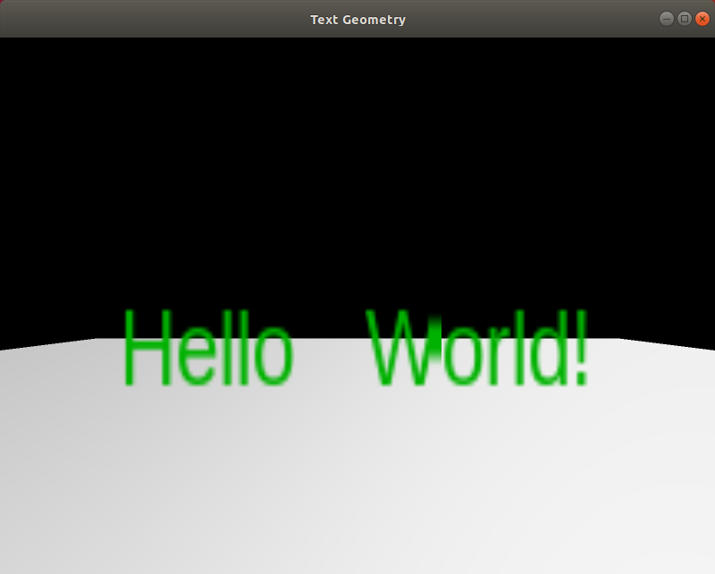

# Text geom

This example shows how to include text in the scene.

# Compile and run the example

Create a build directory and use `cmake` and `make` to compile the code:

```{.sh}
cd ign-rendering/examples/text_geom
mkdir build
cd build
cmake ..
make
```
Execute the example:

```{.sh}
./text_geom
[Msg] Loading plugin [ignition-rendering4-ogre]
Engine 'optix' is not supported
===============================
  TAB - Switch render engines  
  ESC - Exit                   
===============================
```



# Code

We can create text in the same way we create other objects in the scene. We just need to use the scene to create the text using the method `CreateText`. It's possible to configure: font, text and alignment. Then we need to add the text as a visual in the scene:

```{.cpp}
// creat text geometry
TextPtr textGeom = _scene->CreateText();
textGeom->SetFontName("Liberation Sans");
textGeom->SetTextString("Hello World!");
textGeom->SetShowOnTop(true);
textGeom->SetTextAlignment(TextHorizontalAlign::LEFT,
                           TextVerticalAlign::BOTTOM);

// create text visual
VisualPtr text = _scene->CreateVisual();
text->AddGeometry(textGeom);
text->SetLocalPosition(3, 2, 0);
text->SetLocalRotation(0, 0, 0);
// Only diffuse component will be used!
text->SetMaterial(green);
root->AddChild(text);
```
